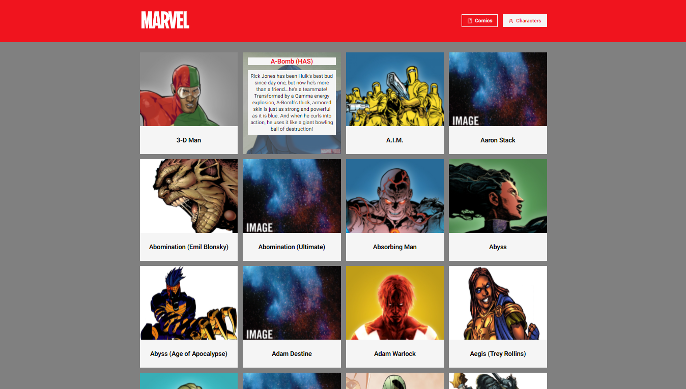
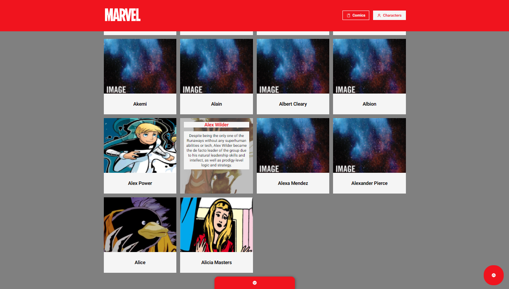
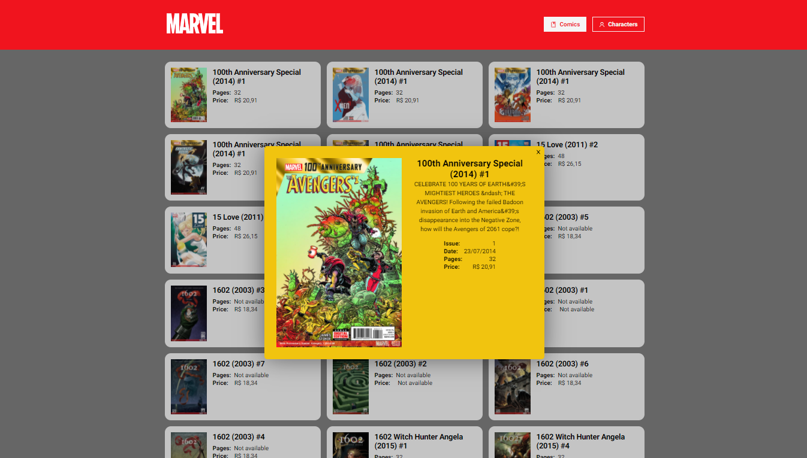
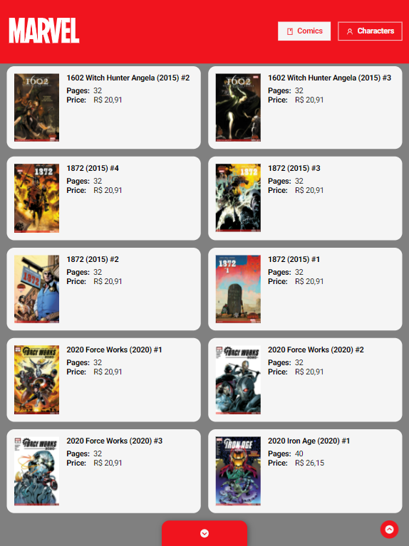
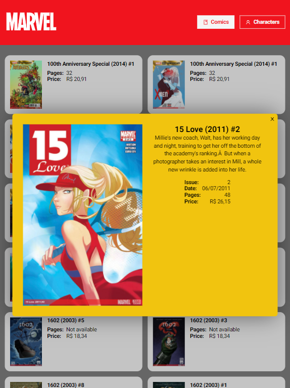
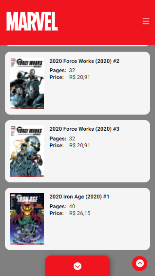
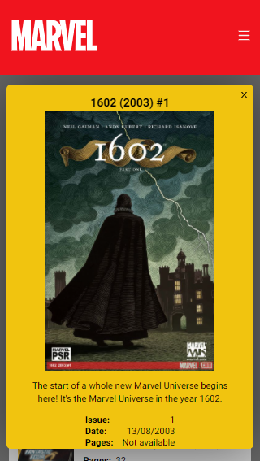

## Marvel API Studying

<div align="center" >
  
</div>

<div align="center" >This project was bootstrapped with [Create React App](https://github.com/facebook/create-react-app/).</div>

<h4 align="center">
  Marvel API Studying is a web app mobile first for practicing API connection.
</h4>

## Desktop

<div align="center">
  
  
  
</div>

## Tablet

<p align="center">
  
  
  
</p>

## Mobile

<p align="center">
  
  
  
  
</p>


## Tecnologies

This project was developed using front-end technology and API from Marvel.

- [ReactJS](https://reactjs.org/)
- [Marvel API](https://developer.marvel.com/)

## 💻 Getting started

### Requirements

- You need to install both [Node.js](https://nodejs.org/en/download/) and [Yarn](https://yarnpkg.com/) to run this project.

**Clone the project and access the folder**

```bash
$ git clone https://github.com/Samuca-sys/marvel-api-studying.git && cd marvel-api-studying
```

**Follow the steps below**

```bash
# Install the dependencies
$ yarn

# Change REACT_APP_API_PUBLIC_KEY and REACT_APP_API_PRIVATE_KEY values from .env-example file
# Rename .env-example file to .env

# Start application
$ yarn start
```

The app will be available for access on your browser at `http://localhost:3000`


## 📝 License

This project is licensed under the MIT License - see the [LICENSE](LICENSE) file for details.

---

Made with 💜 by Samuel Macedo 👋 [Check out my LinkedIn](https://www.linkedin.com/in/samuel-macedo)
